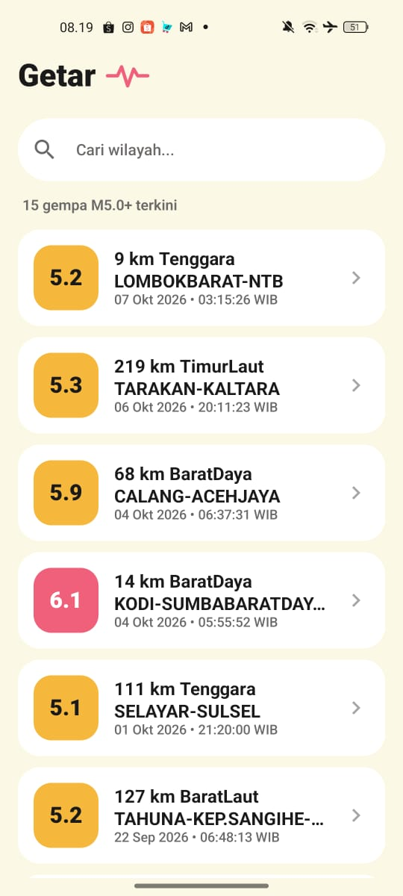
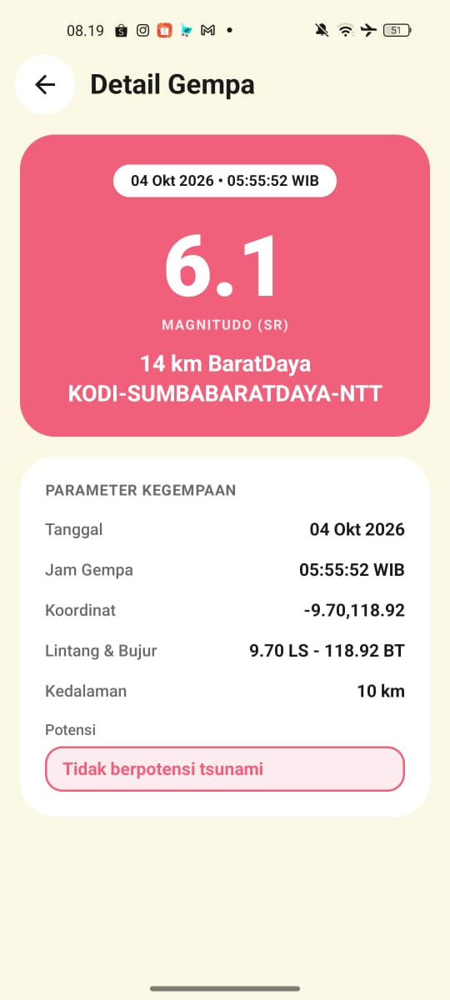

# Getar

Getar adalah aplikasi Android berbasis Jetpack Compose untuk menampilkan daftar gempa bumi berkekuatan M5.0 ke atas dari BMKG. Aplikasi ini dibuat sebagai tugas responsi Praktikum Pemrograman Mobile semester 5.

## Penjelasan Source Code

Dokumentasi dan rekaman penjelasan source code dapat diakses pada link Google Drive berikut:
- [Link Penjelasan Source Code (Google Drive)](https://drive.google.com/drive/folders/1XEmsxAgl8cvoBuaXqut8PYavD-enZzZf?usp=sharing)

## Download APK

File instalasi APK siap pakai dapat diunduh langsung melalui tautan berikut:
-  [Download GetarBMKG.apk (v1.0.0)](https://github.com/cattlevya/Responsi-PemrogramanMobile-H1D024102/releases/download/v1.0.0/GetarBMKG.apk)
-  [Halaman GitHub Releases](https://github.com/cattlevya/Responsi-PemrogramanMobile-H1D024102/releases/tag/v1.0.0)

## Screenshot

| Home | Detail |
|---|---|
|  |  |

## Fitur

- Menampilkan daftar gempa terkini M5.0 ke atas dari BMKG menggunakan LazyColumn.
- Pencarian data gempa lokal berdasarkan nama wilayah.
- Menampilkan status antarmuka saat loading, error koneksi, dan hasil pencarian kosong.
- Halaman detail yang memuat tanggal, jam, koordinat, magnitudo, kedalaman, wilayah, dan potensi tsunami.
- Dukungan tema Light dan Dark yang mengikuti pengaturan sistem.

## Arsitektur

Aplikasi ini menggunakan pola arsitektur Model-View-ViewModel (MVVM).

Alur data berjalan satu arah dari sumber data ke antarmuka. BmkgApiService memanggil endpoint BMKG menggunakan Retrofit dan mengembalikan data mentah dalam bentuk model GempaResponse. GempaRepository mengambil data tersebut dan menyaring list gempa agar aman dari nilai null sebelum dikirim ke ViewModel.

GempaViewModel mengelola status aplikasi menggunakan StateFlow bertipe sealed interface UiState yang memiliki tiga status: Loading, Success, dan Error. Antarmuka Composable (HomeScreen dan DetailScreen) membaca data dari StateFlow tersebut menggunakan collectAsState tanpa memanggil API secara langsung. Instance ViewModel dibuat satu kali di AppNavigation dan dibagikan ke kedua layar.

## API

Aplikasi menggunakan API terbuka dari BMKG tanpa memerlukan API key.

- Endpoint: `https://data.bmkg.go.id/DataMKG/TEWS/gempaterkini.json`
- Metode: GET
- Struktur data: `Infogempa.gempa[]`

Field yang diambil dari objek gempa meliputi Tanggal, Jam, DateTime, Coordinates, Lintang, Bujur, Magnitude, Kedalaman, Wilayah, dan Potensi.

## Teknis

Aplikasi dibangun menggunakan spesifikasi berikut:

- Bahasa: Kotlin 2.0.21
- UI Toolkit: Jetpack Compose dengan Material 3
- Min SDK: 24, Target SDK: 35

Library yang digunakan:
- Retrofit (com.squareup.retrofit2:retrofit:2.11.0)
- Converter Gson (com.squareup.retrofit2:converter-gson:2.11.0)
- Navigation Compose (androidx.navigation:navigation-compose:2.8.5)
- Lifecycle ViewModel Compose (androidx.lifecycle:lifecycle-viewmodel-compose:2.8.7)

Konsep Kotlin yang diterapkan:
- Data class pada model Gempa, Infogempa, dan GempaResponse untuk menampung data JSON.
- Null safety dengan tipe data nullable (String?) dan operator fallback (?:) untuk menghindari crash saat field data bernilai null.
- Lambda expression untuk menangani event klik navigasi dan operasi filter list pada pencarian.
- Extension function (orDash dan magnitudeColor) pada utilitas String dan Double.

Cara menjalankan:
1. Buka folder project ini di Android Studio.
2. Tunggu proses Gradle Sync selesai.
3. Jalankan aplikasi pada emulator atau perangkat fisik Android dengan koneksi internet aktif.
